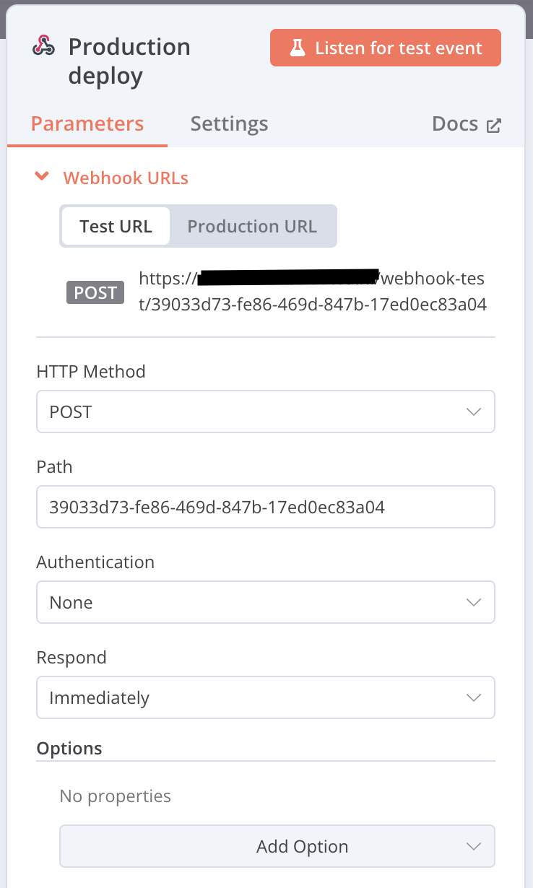

# N8N Trigger

A simple workflow that allows you to trigger a N8N webhook from GitHub Actions. It takes all the `GITHUB_*` variables and sends them to your webhook as payload.

Usage:
```
jobs:
  build:
    runs-on: ubuntu-latest

    steps:
      - name: Inform N8N
        uses: controlaltdelete-nl/n8n-trigger@main
        with:
          webhook-url: "https://your-n8n-url.com/webhook/0d7603a4-2a52-484b-b748-ff61f1589aef"
```

Set your N8N webhook to `POST`:



